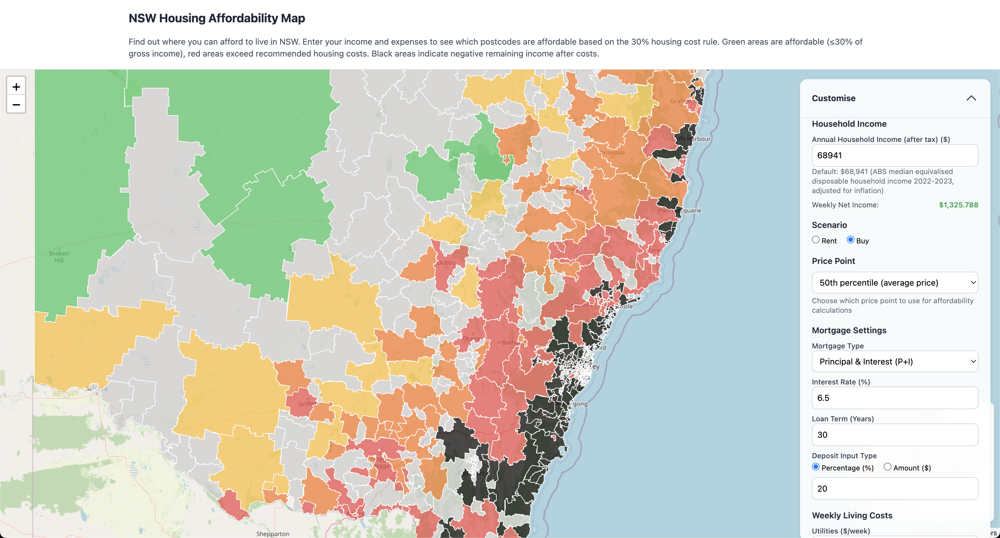

# NSW Housing Affordability Map

An interactive map that helps you find where you can afford to live in NSW based on your income and expenses. The map uses the widely-accepted 30% housing cost rule to determine affordability - green areas are affordable (≤30% of income), while red areas exceed recommended housing costs.

## Features

- **Income Calculator**: Enter your gross annual income and see your net income after Australian taxes
- **Housing Type Selection**: Choose between renting or buying to see relevant affordability data
- **Living Cost Estimates**: Default estimates for utilities, food, transport, and other living costs based on Australian Bureau of Statistics data
- **Mortgage Calculator**: When buying, configure mortgage settings including interest rates, loan terms, and deposit options
- **Owner-Specific Costs**: Additional costs for homeowners including strata fees, council rates, water, and maintenance
- **Interactive Map**: Color-coded postcodes showing affordability based on the 30% rule
- **Detailed Data Table**: Sortable list of all postcodes with affordability information
- **Mobile Responsive**: Works on both desktop and mobile devices

## The 30% Rule

The map uses the widely-accepted housing affordability guideline that housing costs should not exceed 30% of gross income. This standard is used by housing authorities worldwide to determine if housing is affordable:

- **Green (≤30%)**: Affordable - housing costs are within recommended limits
- **Yellow (31-40%)**: Moderate - housing costs are higher than recommended but manageable
- **Orange (41-50%)**: High - housing costs are significantly above recommended levels
- **Red (>50%)**: Unaffordable - housing costs are extremely high relative to income

## Data Sources

This project uses publicly available data from Australian government agencies:

1. **Rent and Sales Data**: Aggregated data from the NSW Department of Communities and Justice (DCJ) rent and sales reports, providing median weekly rent and quarterly sales price data.
   - [Source: NSW Dept. of Planning, Housing & Infrastructure](https://dcj.nsw.gov.au/about-us/families-and-communities-statistics/housing-rent-and-sales/rent-and-sales-report.html)

2. **Postcode Boundaries (GeoJSON)**: Sourced from the Australian Bureau of Statistics (ABS) as part of the Australian Statistical Geography Standard (ASGS).
   - [Source: ABS ASGS Edition 3](https://www.abs.gov.au/statistics/standards/australian-statistical-geography-standard-asgs-edition-3/jul2021-jun2026/access-and-downloads/digital-boundary-files)

3. **Postcode to Suburb Names**: Sourced from data.gov.au, providing a lookup to list the suburbs within each postcode.
   - [Source: data.gov.au ASGS Edition 3 Correspondences](https://www.data.gov.au/data/dataset/asgs-edition-3-2021-correspondences)

4. **Living Cost Defaults**: Based on the Australian Bureau of Statistics Household Expenditure Survey 2019-20.
   - [Source: ABS Household Expenditure Survey](https://www.abs.gov.au/statistics/economy/finance/household-expenditure-survey-australia/latest-release)

5. **Tax Calculations**: Based on Australian tax brackets for the 2024-25 financial year.
   - [Source: Australian Taxation Office](https://www.ato.gov.au/rates/individual-income-tax-rates)

## Technology Stack

- **Mapping**: [Leaflet.js](https://leafletjs.com/)
- **Data Visualization (Box Plots)**: [D3.js](https://d3js.org/)
- **CSV Parsing**: [PapaParse](https://www.papaparse.com/)
- **Styling**: [Tailwind CSS](https://tailwindcss.com/)

## How to Use

1. **Enter Your Income**: Input your annual gross income to see your net income after tax
2. **Choose Housing Type**: Select whether you want to rent or buy
3. **Adjust Living Costs**: Modify the default living cost estimates to match your situation
4. **Configure Mortgage** (if buying): Set interest rates, loan terms, and deposit amounts
5. **Explore the Map**: Click on postcodes to see detailed affordability information
6. **Use the Data Table**: Sort and search through all postcodes to find affordable areas

## License

The code for this project is licensed under the **MIT License**. See the `LICENSE` file for details.

The data sourced from government agencies is subject to Creative Commons Attribution. Please see the source links above for the specific terms.